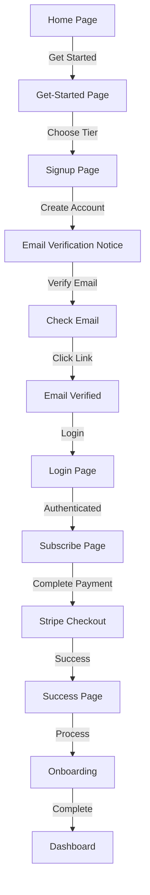

# Flow Analysis and Fixes

## Issues Identified

### Issue 1: Database Error During Signup
**Error**: `Database error finding user` with 500 status from `/auth/v1/signup`

**Root Cause**: The automatic profile creation trigger is missing or failing in the Supabase database. When a user signs up:
1. Supabase Auth creates a user in `auth.users`
2. A trigger should automatically create a corresponding row in `public.profiles`
3. If the trigger is missing/broken, the signup fails with a 500 error

**Impact**: Users cannot create accounts at all.

### Issue 2: Confusing Get-Started Flow
**Problem**: The `/get-started` page asks users to select a tier and "get started", but:
- It redirects to `/signup` which requires email verification
- Users can't proceed to payment until email is verified
- This creates confusion about what "get started" means

**Current Flow**:
```
Home → Get Started → Select Tier → Signup → Verify Email → Login → Subscribe → Payment
```

**User Expectation**:
```
Home → Get Started → Signup → Verify Email → Login → Payment → Onboarding
```

**The Confusion**: The "Get Started" page feels like it should be the beginning of the signup process, but it's actually a pricing/tier selection page that comes before signup. Users don't understand why they need to verify email before seeing pricing.

## Solutions

### Solution 1: Fix Database Trigger

**Action**: Run the migration to recreate the profile creation trigger.

**SQL to Execute** (in Supabase SQL Editor):

```sql
-- Drop existing trigger and function if they exist
DROP TRIGGER IF EXISTS on_auth_user_created ON auth.users;
DROP FUNCTION IF EXISTS public.handle_new_user();

-- Recreate the function to auto-create profile on user signup
CREATE OR REPLACE FUNCTION public.handle_new_user()
RETURNS TRIGGER 
SECURITY DEFINER
SET search_path = public
LANGUAGE plpgsql
AS $$
BEGIN
  -- Insert a new profile for the user
  INSERT INTO public.profiles (id, created_at, updated_at)
  VALUES (NEW.id, NOW(), NOW())
  ON CONFLICT (id) DO NOTHING;
  
  RETURN NEW;
EXCEPTION
  WHEN OTHERS THEN
    -- Log the error but don't fail the signup
    RAISE WARNING 'Error creating profile for user %: %', NEW.id, SQLERRM;
    RETURN NEW;
END;
$$;

-- Recreate the trigger
CREATE TRIGGER on_auth_user_created
  AFTER INSERT ON auth.users
  FOR EACH ROW 
  EXECUTE FUNCTION public.handle_new_user();

-- Grant necessary permissions
GRANT USAGE ON SCHEMA public TO postgres, anon, authenticated, service_role;
GRANT ALL ON public.profiles TO postgres, service_role;
GRANT SELECT, INSERT, UPDATE ON public.profiles TO authenticated;
```

**Verification**:
```sql
-- Check if trigger exists
SELECT 
  trigger_name,
  event_manipulation,
  event_object_table,
  action_statement
FROM information_schema.triggers
WHERE trigger_name = 'on_auth_user_created';
```

### Solution 2: Simplify Get-Started Flow

**Option A: Direct Signup (Recommended)**
- Keep `/get-started` as a pricing comparison page
- Change all "Choose [Tier]" buttons to go directly to `/signup?tier=X`
- This makes it clear that signup is the first step
- Current implementation already does this!

**Option B: Remove Get-Started Page**
- Remove `/get-started` entirely
- Put pricing on home page
- Direct "Get Started" buttons to `/signup?tier=X`
- Simpler but loses the detailed comparison page

**Recommendation**: Option A is already implemented correctly. The issue is user perception, not the flow itself.

### Solution 3: Improve User Communication

**Changes to Make**:

1. **Update Home Page CTA Text**:
   - Change "Start Free Trial" to "Create Free Account"
   - This makes it clear account creation comes first

2. **Update Get-Started Page Header**:
   - Change "Welcome to Trade Control" to "Choose Your Plan"
   - Add subtext: "Step 1: Select a plan • Step 2: Create account • Step 3: Verify email • Step 4: Complete payment"

3. **Update Signup Page**:
   - Add progress indicator showing: "Step 2 of 4: Create Your Account"
   - Show selected tier at the top

4. **Add Email Verification Context**:
   - In the email verification notice, explain: "We need to verify your email before you can set up billing"

## Implementation Plan

### Step 1: Fix Database Trigger (CRITICAL)
1. Run the SQL migration in Supabase SQL Editor
2. Verify trigger exists
3. Test signup with a new email

### Step 2: Improve User Communication
1. Update home page CTA text
2. Add progress indicators to signup flow
3. Update get-started page header
4. Improve email verification messaging

### Step 3: Test Complete Flow
1. Start from home page
2. Click "Get Started"
3. Select a tier
4. Create account
5. Verify email
6. Login
7. Complete subscription
8. Verify organization created

## Current Flow (Correct, Just Needs Better Communication)



## Files to Modify

### Critical (Database Fix)
- `supabase/migrations/011_fix_profile_creation_trigger.sql` (already created)

### User Experience Improvements
- `app/page.tsx` - Update CTA text
- `app/(auth)/get-started/page.tsx` - Add progress context
- `app/(auth)/signup/page.tsx` - Add progress indicator and tier display
- `app/(auth)/login/page.tsx` - Add context about next steps

## Testing Checklist

- [ ] Database trigger exists and works
- [ ] Can create new account
- [ ] Profile is automatically created
- [ ] Email verification works
- [ ] Login redirects to subscribe page
- [ ] Subscribe page shows correct tier
- [ ] Payment completes successfully
- [ ] Organization is created
- [ ] Onboarding appears
- [ ] Dashboard is accessible after onboarding

## Notes

The current flow is actually correct from a technical standpoint:
1. Email verification MUST happen before payment (security best practice)
2. The get-started page is a standard pricing/comparison page
3. The flow is: Select → Signup → Verify → Pay → Onboard

The issue is primarily:
1. **Critical**: Database trigger is broken (prevents signup entirely)
2. **UX**: Users don't understand the multi-step process
3. **UX**: No visual progress indicators

Once the database trigger is fixed and progress indicators are added, the flow will be clear and functional.
