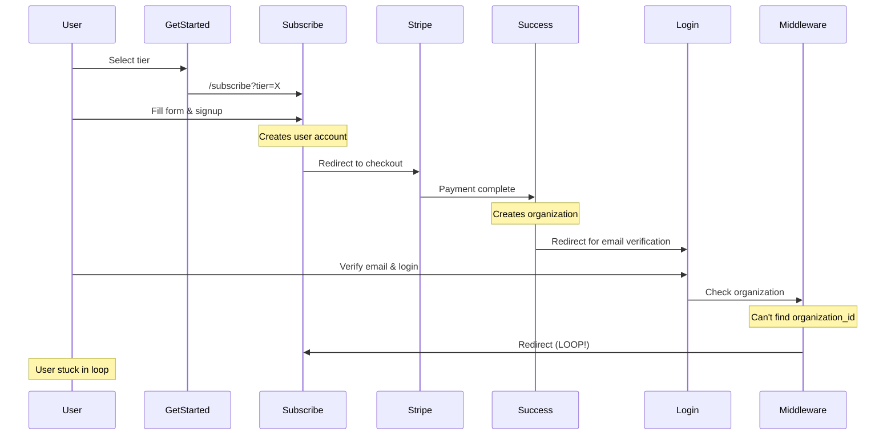
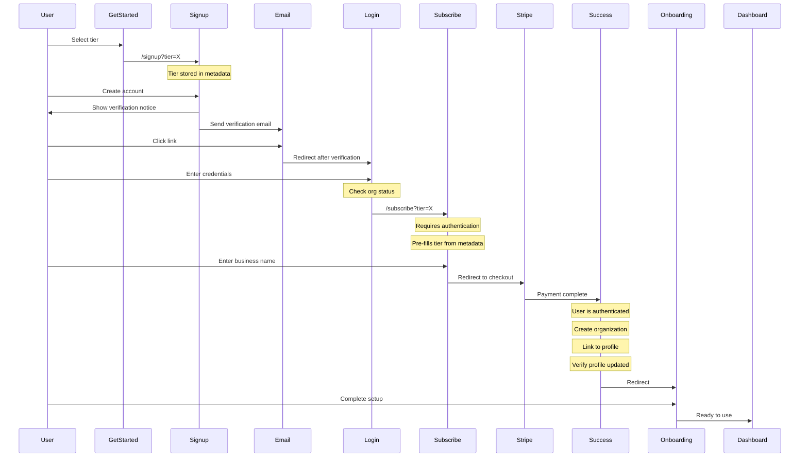
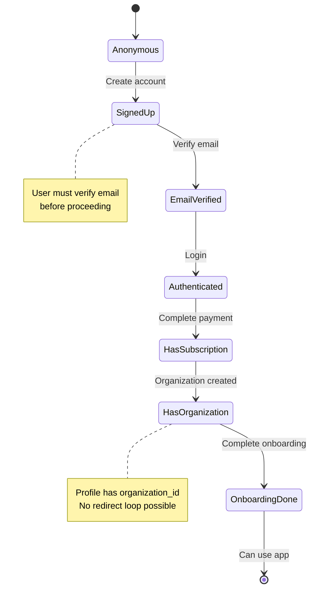
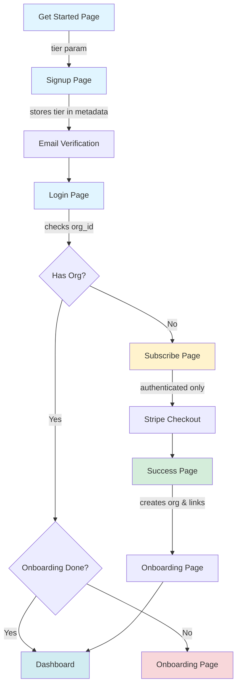
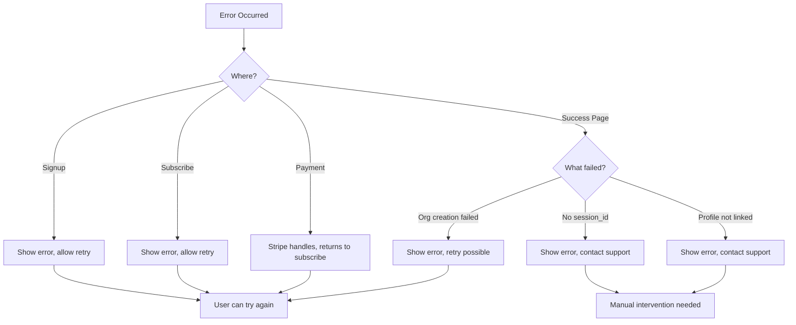

# Signup Flow Comparison

## Old Flow (Caused Redirect Loop)



## New Flow (Fixed)



## Key Differences

### Old Flow Issues
❌ Payment before email verification
❌ Organization created while user not authenticated
❌ Disconnect between auth session and organization
❌ Middleware couldn't find organization_id
❌ Redirect loop to subscribe page

### New Flow Benefits
✅ Email verification required first
✅ Payment only after authentication
✅ Organization created while user authenticated
✅ Profile immediately linked to organization
✅ Middleware finds organization_id
✅ No redirect loops
✅ Tier preserved through metadata
✅ Clearer user journey

## Middleware Logic

### Old Logic
```
if (user && !organization_id) {
  redirect('/subscribe')  // Could cause loop
}
```

### New Logic
```
if (!user && accessing_subscribe) {
  redirect('/signup')
}

if (user && !organization_id && accessing_protected_route) {
  redirect('/subscribe')
}

if (user && organization_id && accessing_auth_pages) {
  redirect('/dashboard' or '/onboarding')
}
```

## State Machine



## File Responsibility



## Authentication States

| State | Can Access | Redirected To | Notes |
|-------|-----------|---------------|-------|
| **Anonymous** | /, /get-started, /signup, /login | - | Public pages only |
| **Signed Up (unverified)** | Email verification page | - | Must verify email |
| **Verified (no org)** | /subscribe | /subscribe | Must complete payment |
| **Has Org (no onboarding)** | /onboarding, /logout | /onboarding | Must complete setup |
| **Fully Set Up** | All protected routes | /dashboard | Full access |

## Error Recovery Paths



## Session Storage Data

During the flow, `sessionStorage` holds:

```typescript
{
  pending_subscription: {
    user_id: string,      // UUID of authenticated user
    email: string,        // User's email
    businessName: string, // Business name entered
    tier: string,         // 'operations' or 'operations_pro'
    operationsProLevel: string | null, // 'scale' or 'unlimited'
    totalPrice: number    // Total monthly price in dollars
  }
}
```

This is cleared after successful organization creation.

## User Metadata

During signup, user metadata contains:

```typescript
{
  first_name: string,
  last_name: string,
  selected_tier?: string,  // NEW: Preserved for subscribe page
}
```

This allows the tier selection to be remembered across email verification and login.
